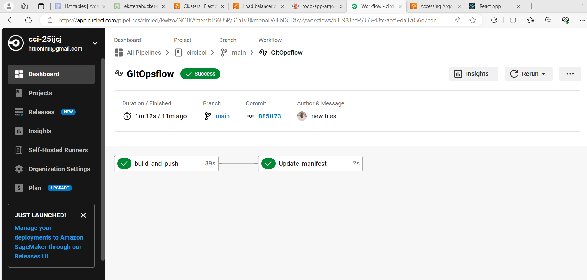
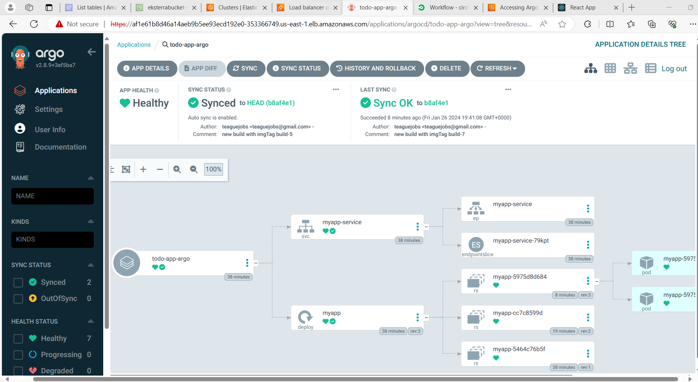
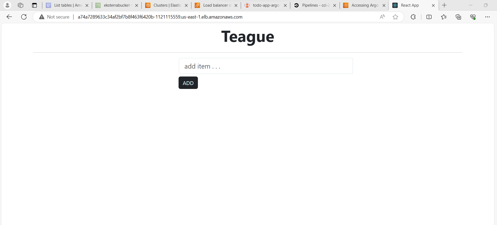

# Deploying Dockerized App on AWS EKS Cluster using ArgoCD and GitOps methodology with CircleCI

This repository contains the code of the React application called ToDo-App. I've created this to Deploy it on Kubernetes cluster by GitOps workflow

## Architecture

This post provides a comprehensive guide on deploying a Dockerized application to an AWS EKS cluster using a CI/CD approach with GitOps methodology. The step-by-step guide covers CircleCI for Continuous Integration and ArgoCD for Continuous Deployment in a GitOps workflow. Following these instructions, you can streamline your application deployment process to an AWS EKS cluster.

 **Narrative**

To begin, our project will involve three separate Git repositories: the application code repository, the Terraform code repository for building the infrastructure of the EKS cluster, and the Kubernetes manifest repository containing the YAML files.

The developer will create and commit a new feature to the application code repository. Once CircleCI detects this change or new commit in the application code repository, it will initiate the pipeline we’ve configured. 

The pipeline consists of four jobs or steps:

1. Test: This step involves testing the application code to ensure its functionality and quality.

2. Build: At this step, we build a Docker image of the application to ensure consistency across different environments by packaging it and any required dependencies.

3. Push: The Docker image is built and pushed to a registry for deployment on the EKS cluster.
Revise manifest: Refresh the manifest repository with a fresh TAG.

4. After the pipeline is finished, a Docker image and updated manifest file will be generated. To facilitate the GitOps process, we have established a synchronization between ArgoCD and our GitHub manifest repository. Whenever changes are made to the manifest file, ArgoCD will obtain and implement the updated version in the cluster. If anyone attempts to modify Kubernetes cluster objects manually, ArgoCD will instantly return to the previous state. Consequently, the manifest repository is the only trustworthy information source, as ArgoCD confirmed.

**Prerequisites**

AWS Account

CircleCI Account

GitHub Account

Docker Account

Basic knowledge of Linux

## Amazon EKS and how does it work?
Amazon Elastic Kubernetes Service (Amazon EKS) is a managed service that you can use to run Kubernetes on AWS without installing, operating, and maintaining your own Kubernetes control plane or nodes.

**Amazon EKS:**

- Runs and scales the Kubernetes control plane across multiple AWS Availability Zones to ensure high availability.
- Automatically scales control plane instances based on load, detects and replaces unhealthy control plane instances, and provides automated version updates and patches.
- Amazon EKS supports applications compatible with standard Kubernetes environments, regardless of location- on-premises or in public clouds. The best part is that it eliminates the need for any code modifications, making migrating standard Kubernetes applications to Amazon EKS seamless.

*Amazon EKS* provides and manages the Kubernetes control plane and worker nodes for you. At a high level, Kubernetes consists of two major components: a cluster of worker nodes that run your containers and the control plane that manages when and where containers are started on your cluster and monitor their status. Communication between the control plane and worker nodes happens through ENIs.

If you're using Amazon EKS, you must handle the Kubernetes control plane and worker node cluster yourself. But with Amazon EKS, you can quickly set up worker nodes by entering a single command in the EKS console, CLI, or API. AWS will handle provisioning, scaling, and managing the Kubernetes control plane in a secure and highly available configuration. This means you won't have to worry about running Kubernetes and can focus on developing applications instead of managing AWS infrastructure.

**What is GitOps?**
Modern and cloud-native applications are developed with speed and scale in mind. Organizations with a mature DevOps culture can deploy code to production hundreds of times per day. DevOps teams can accomplish this through development best practices such as version control, code review, and CI/CD pipelines that automate testing and deployments.

**IaaC:** Automating infrastructure provisioning through GitOps involves storing configuration files as code, similar to how application source code is utilized.

**CI/CD:** GitOps automates infrastructure updates with Git workflows, including CI/CD. Changes are applied automatically, and GitOps overwrites any drift. GitLab uses CI/CD for automation, but other types, like definition operators, can be used too.

**Single source of truth:** GitOps uses Git as the single source of truth to define a cloud-native system. GitOps agent (Flux) applies to code, configuration, and policies across all environments.

## List of AWS services
- Amazon EKS 
- Amazon VPC
- Amazon  IAM
- Amazon EC2
- Amazon Autoscaling 
- Amazon S3
- DynamoDB 

## Tech stack

- React Js

## Step-by-step Guide

[Introduction to EKS and GitOps](https://medium.com/p/71983375e550/edit)

[How to provision Amazon EKS Cluster using Terraform](https://medium.com/p/aa96d9a00391/edit)

[How to set pipeline using CircleCI, update GitHub Kubernetes manifest repo, and push image on Docker Hub](https://medium.com/p/e604412e959f/edit)

[Install ArgoCD on the EKS cluster and configure sync with the GitHub manifest repository](https://medium.com/p/9e3d62e1c093/edit)

**This blog contains Three GitHub repositories**

➡️ [App Code] (https://github.com/teaguejobsAppCode)

➡️ [Terraform code] (https://github.com/teaguejobs/kube_terraform)

➡️ [Manifest Repo] (https://github.com/teaguejobs/kube_manifest)

## Conclusion

We used ArgoCD and the GitOps approach with CircleCI to deploy a dockerized application on an AWS EKS cluster. To start, we set up the Amazon EKS cluster using Terraform. This gave us a strong base for our deployment. After that, we made the pipeline work with CircleCI and GitHub. and setup ArgoCD on our cluster for continious delivery.This ensured our Kubernetes setups and the CI/CD process worked smoothly.

If you want to learn how I created this project,  I've shared links to all the blogs above.👆

🙏 Thank you so much for reading.

